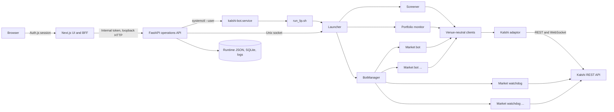

# Kalshi Algorithmic Market-Making System

This repository contains an automated Kalshi market-screening, market-making, risk-management, monitoring, and operations system. It can scan the Kalshi market catalog for candidates, run one top-of-book quoting bot per selected market, supervise each bot with an independent watchdog, record detailed telemetry and run history, and expose the fleet through an authenticated web UI.

> [!WARNING]
> This software can place real orders and lose real money. The default saved-session configuration targets the production environment. Validate the installation with a CLI dry run, then use the Kalshi demo environment with small limits before enabling production trading. Stopping the fleet cancels bot-owned resting orders but deliberately retains filled inventory.

## Contents

- [System overview](#system-overview)
- [Architecture](#architecture)
- [Installation](#installation)
- [Configuration](#configuration)
- [Running the system](#running-the-system)
- [Launcher](#launcher)
- [Bots and risk controls](#bots-and-risk-controls)
- [Clients and Kalshi adaptor](#clients-and-kalshi-adaptor)
- [Operations API](#operations-api)
- [Storage and artifacts](#storage-and-artifacts)
- [Web UI](#web-ui)
- [Operations and troubleshooting](#operations-and-troubleshooting)
- [Testing](#testing)

## System overview

The normal fleet lifecycle is:

1. The launcher loads the selected saved session or command-line configuration.
2. The screener retrieves open Kalshi markets, applies liquidity, time, spread, expected-value, exclusion, and historical markout filters, and writes `screener_export.csv`.
3. The launcher reconciles the latest picks with the currently running fleet.
4. `ShardedBotManager` assigns markets to as many as 20 workers, with at most 25 in-process `MarketActor` state machines per worker.
5. Each worker consumes one multi-market WebSocket and emits immutable quote intents; the execution broker is the only process that writes orders.
6. Each worker runs staggered pure risk evaluation and publishes `normal`, `reduction_only`, or `flatten_only` state for every actor.
7. The launcher publishes a consolidated JSON status snapshot and listens on a local Unix control socket.
8. The loopback FastAPI service reads the snapshots and local databases, executes guarded controls, and serves data to the authenticated Next.js UI.

The primary entrypoints are:

| Entry point | Purpose |
| --- | --- |
| `run_lip.sh` | Standard fleet wrapper used by `kalshi-bot.service` |
| `lip_launcher.py` | Parses fleet arguments, claims a saved-session run, and starts `Launcher` |
| `launcher.py` | Async fleet coordinator for screening, reconciliation, portfolio monitoring, status, and controls |
| `V1.py` | Compatible single-market bot entrypoint |
| `kalshi_screener.py` | Standalone public market screener and CSV exporter |
| `ui_api.app:app` | FastAPI operations service |
| `web/` | Next.js operations console |

## Architecture



The browser never receives Kalshi credentials or the internal API token. Next.js acts as a backend-for-frontend (BFF), authenticates the operator, and injects the internal token when proxying requests to FastAPI.

## Installation

### Prerequisites

The supplied deployment targets Linux with user-level systemd services and Unix sockets. Install:

- Python 3.10 or newer (3.11+ recommended)
- Node.js 20.9 or newer and npm
- OpenSSL
- A Kalshi account, API key ID, and matching unencrypted RSA private key in PEM format
- `systemd` user services for the supplied production layout

An SSH tunnel is the expected remote-access method. Use an HTTPS reverse proxy before exposing the UI to a LAN or the internet.

### 1. Clone and install Python dependencies

The service files assume the repository is located at `~/Kalshi_alg`. If it is installed elsewhere, update the `WorkingDirectory` and `ExecStart` values in `deploy/systemd/*.service`.

```bash
git clone <repository-url> ~/Kalshi_alg
cd ~/Kalshi_alg

python3 -m venv .venv
.venv/bin/python -m pip install --upgrade pip
.venv/bin/python -m pip install -r requirements-ui.txt pandas websockets

python3 -m venv .venv-ui
.venv-ui/bin/python -m pip install --upgrade pip
.venv-ui/bin/python -m pip install -r requirements-ui.txt
```

`run_lip.sh` uses `.venv/bin/python` by default. Override that interpreter with `KALSHI_PYTHON_BIN` if needed. The operations API systemd unit explicitly uses `.venv-ui/bin/uvicorn`.

### 2. Install and build the web application

```bash
cd ~/Kalshi_alg/web
npm ci
npm run build
cd ..
```

If Node was installed with a per-user version manager, update `ExecStart` in `kalshi-ui-web.service`; the supplied unit expects `/usr/bin/npm`.

### 3. Install the Kalshi private key

Store the private key outside the repository and restrict it to the service account:

```bash
mkdir -p ~/.config/kalshi-alg
install -m 600 /path/to/downloaded-kalshi-key.pem ~/.config/kalshi-alg/kalshi-private-key.pem
```

Never commit a private key, API key, password, generated environment file, or runtime database.

### 4. Create service environment files

```bash
install -m 600 deploy/bot.env.example ~/.config/kalshi-alg/bot.env
install -m 600 deploy/ui.env.example ~/.config/kalshi-alg/ui.env
```

Edit `~/.config/kalshi-alg/bot.env`:

```dotenv
KALSHI_API_KEY_ID=your-key-id
KALSHI_PRIVATE_KEY_PATH=/home/your-user/.config/kalshi-alg/kalshi-private-key.pem
MAXIMUM_PROJECTED_CONTRACTS_PER_LINE=10
KALSHI_SESSION_STORE=/home/your-user/Kalshi_alg/session_data
```

Generate two independent random values for `AUTH_SECRET` and `KALSHI_UI_INTERNAL_TOKEN`:

```bash
openssl rand -base64 32
openssl rand -base64 32
```

Generate the UI password hash from inside `web/`:

```bash
cd ~/Kalshi_alg/web
node -e "require('argon2').hash(process.argv[1], {type: require('argon2').argon2id}).then(console.log)" 'choose-a-strong-password'
```

Put the resulting values in `~/.config/kalshi-alg/ui.env`:

```dotenv
AUTH_SECRET=first-long-random-value
KALSHI_UI_USERNAME=operator
KALSHI_UI_PASSWORD_HASH=generated-argon2id-hash
KALSHI_UI_INTERNAL_TOKEN=second-long-random-value
KALSHI_API_URL=http://127.0.0.1:8001
KALSHI_WORKSPACE=/home/your-user/Kalshi_alg
KALSHI_RUNTIME_DIR=/home/your-user/Kalshi_alg/runtime
KALSHI_SESSION_STORE=/home/your-user/Kalshi_alg/session_data
KALSHI_BOT_SERVICE=kalshi-bot.service
```

The API can display canonical exchange positions only when its environment also contains the following values. Add them to `ui.env` if that feature is required:

```dotenv
KALSHI_API_KEY_ID=your-key-id
KALSHI_PRIVATE_KEY_PATH=/home/your-user/.config/kalshi-alg/kalshi-private-key.pem
KALSHI_SUBACCOUNT=0
```

The UI and API must use the same `KALSHI_UI_INTERNAL_TOKEN`. The token is required on every FastAPI route and should never be exposed to the browser or used as the operator password.

### 5. Install systemd user services

```bash
mkdir -p ~/.config/systemd/user
cp deploy/systemd/*.service ~/.config/systemd/user/
systemctl --user daemon-reload
systemctl --user enable --now kalshi-ui-api.service kalshi-ui-web.service
```

Do not enable or start `kalshi-bot.service` until the selected session has been reviewed. If the services must run while the user is logged out, an administrator can enable lingering for the service account:

```bash
sudo loginctl enable-linger "$USER"
```

### 6. Open the UI

From the operator workstation:

```bash
ssh -L 3000:127.0.0.1:3000 trading-host
```

Visit `http://127.0.0.1:3000`, sign in, and open **Sessions**. Before the first live run:

1. Create or edit a session.
2. Set `execution.useDemo` to `true`.
3. Use small `launcher.yesBudgetCents`, `launcher.noBudgetCents`, `launcher.maxBots`, and `bot.maximum_projected_contracts_per_line` values.
4. Save the session and select it for the next run.
5. Run a dry launch-plan check before allowing order placement.

## Configuration

### Configuration sources and precedence

There are three configuration layers:

1. **Saved session** — when `--session-store` is present, the selected or prepared run snapshot is authoritative for execution, launcher, watchdog, and bot settings.
2. **Command line** — used for paths and for runtime settings when no session store is enabled. Bot identity and runtime paths are also injected into each saved-session bot settings file.
3. **Environment** — used for secrets, credential paths, workspace paths, and limited direct-bot fallbacks.

Credentials are not part of saved sessions. A run stores only credential-free configuration. When a run starts, it captures an immutable configuration version; editing a session affects the next run, not the active one.

With session storage enabled, changing a matching constant in `run_lip.sh` does not override the selected session. Make strategy changes in the **Sessions** UI, or omit `--session-store` for an explicitly command-line-managed run.

### Environment variables

| Variable | Component | Meaning |
| --- | --- | --- |
| `KALSHI_API_KEY_ID` | Launcher, bots, watchdog, optional API | Kalshi API key identifier |
| `KALSHI_PRIVATE_KEY_PATH` | Launcher, bots, watchdog, optional API | Absolute path to the RSA PEM key |
| `KALSHI_PYTHON_BIN` | `run_lip.sh` | Python interpreter override |
| `MAXIMUM_PROJECTED_CONTRACTS_PER_LINE` | Direct bot fallback | Absolute projected position cap when no settings file or CLI value supplies it |
| `AUTH_SECRET` | Next.js/Auth.js | Secret used to protect UI sessions |
| `KALSHI_UI_USERNAME` | Next.js/Auth.js | Operator login username |
| `KALSHI_UI_PASSWORD_HASH` | Next.js/Auth.js | Argon2id password hash, never plaintext |
| `KALSHI_UI_INTERNAL_TOKEN` | Next.js and FastAPI | Shared BFF-to-API authentication token |
| `KALSHI_API_URL` | Next.js | Loopback FastAPI base URL |
| `KALSHI_WORKSPACE` | FastAPI | Repository/runtime workspace |
| `KALSHI_RUNTIME_DIR` | Launcher and FastAPI | Status and control-socket directory |
| `KALSHI_LOGS_DIR` | FastAPI | Optional legacy log-directory override |
| `KALSHI_WATCHDOG_DIR` | FastAPI | Optional watchdog-state directory override |
| `KALSHI_SESSION_STORE` | Launcher and FastAPI | Saved-session database and artifact root |
| `KALSHI_BOT_SERVICE` | FastAPI | User systemd service controlled by the UI |
| `KALSHI_SUBACCOUNT` | FastAPI position lookup | Kalshi subaccount number; defaults to `0` |

### Saved-session schema

Saved configuration is versioned by `session_config.py` and divided into:

- `execution`: demo/production selection, dry-run mode, and subaccount.
- `launcher`: fixed ticker or screened fleet, bot count, per-side budgets, launch delay, refresh schedule, poll period, and inventory carryover threshold.
- `watchdog`: profiling cadence, state refresh and staleness thresholds, sample interval, confidence thresholds, and emergency flatten retries.
- `fleetRuntime`: shard sizing, quote freshness, API utilization, cash reserve, series concentration, heartbeat, and startup gates.
- `bot`: all remaining `BotSettings` strategy, sizing, fair-value, toxicity, queue, quote, telemetry, and inventory fields.

The canonical defaults and validation rules are in `session_config.py` and the `BotSettings` dataclass in `top_of_book_bot.py`. Unknown fields are rejected, and numeric relationships such as watchdog threshold ordering are validated before a session is saved or launched.

### Screener configuration

`kalshi_screener_config.py` controls the public market scan. Important groups include:

- market status, MVE handling, maximum catalog size, and exported top-N count;
- minimum/maximum spread, bid, volume, open interest, and time-to-close filters;
- permanently excluded ticker keywords;
- target expected edge, fee buffer, tick assumptions, and quote size;
- historical markout filters at ticker and series scope;
- realized net-per-contract and total-loss thresholds;
- output CSV and optional standalone loop interval.

The fleet's `maxBots` is independent of the screener's exported `TOP_N`: the CSV may contain more markets than the launcher is allowed to run.

## Running the system

### Recommended UI-managed workflow

Start the supporting services:

```bash
systemctl --user start kalshi-ui-api.service kalshi-ui-web.service
```

In the UI:

1. Review, save, and select a session.
2. Use **Overview → Start** to start the fleet.
3. Watch Overview, Markets, Portfolio, and Monitoring for startup health.
4. Use **Refresh** to rerun the screener and reconcile the fleet.
5. Use **Disable** on a market to stop its bot and persist the ticker in the disable list.
6. Use **Stop** to stop the fleet and verify cancellation of bot-owned resting orders.

UI mutations require an authenticated session, same-origin requests, confirmation in the browser, and a request ID. Results are written to the audit database.

### CLI launch-plan check

Set `execution.dryRun=true` in the selected saved session, then run:

```bash
cd ~/Kalshi_alg
./run_lip.sh
```

This runs screening/reconciliation far enough to display the launch plan but does not start child bot processes. A dry-run service exits normally after the plan; it is not a continuously running monitoring mode.

After validation, set `dryRun=false` and keep `useDemo=true` for the first integrated trading run.

### Standalone screener

The screener uses public market data and does not place orders:

```bash
.venv/bin/python kalshi_screener.py --output screener_export.csv --top-n 50
```

Use `--run-forever --cycle-seconds 60` for standalone loop mode. The integrated launcher normally runs the same screening logic on its configured schedule.

### Standalone single-market bot

For focused testing, run one market directly:

```bash
KALSHI_API_KEY_ID=your-key-id \
KALSHI_PRIVATE_KEY_PATH="$HOME/.config/kalshi-alg/kalshi-private-key.pem" \
.venv/bin/python V1.py \
  --ticker MARKET-TICKER \
  --yes-budget-cents 100 \
  --no-budget-cents 100 \
  --maximum-projected-contracts-per-line 5 \
  --use-demo \
  --dry-run
```

Even in direct dry-run mode, credentials are needed to retrieve authenticated state. Remove `--dry-run` only after reviewing the market, environment, budgets, exposure cap, and watchdog arrangement. The fleet launcher is preferred because it supplies watchdog state, telemetry paths, supervision, and authoritative shutdown cleanup.

## Launcher

`lip_launcher.py` owns CLI compatibility and startup validation. Its current `main()` constructs the async `Launcher` in `launcher.py`.

The launcher is responsible for:

- claiming a pending run or snapshotting the selected session;
- running or seeding the screener;
- applying fixed-ticker mode when configured;
- reconciling added, changed, retained, and removed markets;
- carrying markets with material inventory across screener refreshes;
- starting and monitoring the execution broker and sharded workers;
- refreshing account-wide portfolio state;
- publishing `runtime/launcher_status.json` atomically;
- accepting refresh/disable/enable commands on `runtime/launcher.sock`;
- sampling run metrics and finalizing run status;
- freezing all workers, stopping intent generation, and verifying bot-owned order cancellation twice.

`ShardedBotManager` maintains the desired fleet, bounded rendezvous assignments, pushed worker heartbeats, broker capacity, and capital allocation. A worker exit affects at most 25 markets; its exposure-increasing orders are canceled before that shard is restarted.

During a fleet shutdown, the manager freezes workers, performs an authoritative broker-owned cancellation pass for bot-tagged resting orders, stops the workers, and verifies the account again. A shutdown that cannot verify order removal is reported as failed. Filled inventory is never silently flattened merely because the service stopped.

Key launcher controls include:

| Setting | Effect |
| --- | --- |
| `fixedTicker` | Runs one explicit ticker instead of the screened fleet |
| `maxBots` | Maximum concurrent selected markets, from 1 through 500; default 40 |
| `yesBudgetCents` / `noBudgetCents` | Default working budget per market side |
| `runScreenerOnStart` | Refreshes public market selection before launch |
| `refreshIntervalSeconds` | Periodic screening/reconciliation interval; `0` disables scheduled refresh |
| `pollSeconds` | Upper bound for launcher monitoring cadence |
| `minimumCarryoverValueCents` | Keeps removed markets running when marked inventory exceeds this value |

## Bots and risk controls

### Top-of-book bot

Production workers create `MarketActor` instances from `top_of_book_bot.py` and drive them from a shared stream. `V1.py` is the single-market development/replay wrapper around that same actor implementation; it is not a production fallback.

The bot uses fixed-point arithmetic internally:

- price scale: `10,000` units per dollar;
- count scale: `100` units per contract;
- `100` price units per cent.

The strategy combines market midpoint, ticker data, recent public trades, order-book imbalance, fees, inventory, queue position, historical fill probability, markout toxicity, and incentives. It evaluates candidate levels and only keeps quotes that satisfy configured edge and safety rules.

Major control groups in `BotSettings` include:

| Group | Representative behavior |
| --- | --- |
| Sizing | Per-side budgets, per-order cap, fee buffer, and projected line-position cap |
| Quote placement | Post-only orders, requote interval, expirations, tick improvement, and minimum bid/ask rules |
| Inventory | One-way guard, inventory skew, pair guard, and reduction exceptions |
| Market quality | Minimum depth, top-level gap, liquidity-pull detection, and phantom-spread protection |
| Adverse selection | Markout-based bucket pessimism, toxicity penalties, post-fill cooldowns, and same-side suppression |
| Queue management | Queue-ahead limits, abandonment confirmation, and side/market cooldowns |
| Fair value and EV | Input weights, edge thresholds, fee assumptions, candidate levels, and fill-probability priors |
| Startup/shutdown | Startup cancellation of strategy-owned quotes, stream subscriptions, and verified graceful cancellation |
| Telemetry | SQLite enablement, markout horizons, model refresh interval, and durable P&L paths |

Every order uses a strategy client-order-ID prefix. Cleanup targets only known bot prefixes, avoiding indiscriminate cancellation of unrelated account orders.

### Watchdog

Production has no persistent per-market watchdog or profiler processes. Each worker evaluates rolling book/trade windows with pure `RiskEvaluator` functions every 60 seconds, staggered deterministically across its markets. Risk becomes stale after 120 seconds, and a failed or stale evaluation can only tighten the current mode.

The normalized modes are:

- `normal`: ordinary quoting is permitted subject to bot controls.
- `reduction_only`: risk-increasing quotes are suppressed; existing inventory may be reduced.
- `flatten_only`: quoting is canceled and the bot attempts its configured emergency inventory reduction behavior.

The bot treats missing or excessively stale watchdog state as a fail-safe condition. The watchdog can also escalate to `flatten_only` when observed future-mid markouts show either poor size-weighted net performance or a configured total session loss. It never uses the bot's own fair-value estimate as ground truth for this circuit breaker.

Risk state is included in each pushed worker heartbeat. A persistent disable list prevents a rejected or risk-exited market from being reassigned until an operator explicitly enables it.

### Screener and portfolio monitor

The integrated `Screener` adapts the venue-neutral client to the existing EV algorithm, writes CSV output atomically, excludes disabled markets, and emits a generation diff for `BotManager`. If a market falls out of the screen but still has material inventory, the launcher can retain it so the inventory remains managed.

`PortfolioMonitor` separately retrieves balance, limits, positions, resting orders, recent orders/fills, and market marks. It maintains short incremental caches and exposes account-wide state through the launcher snapshot. This view includes all matching account activity, while per-bot telemetry is process/session scoped.

## Clients and Kalshi adaptor

The `clients/` package defines a venue-neutral boundary:

- `base_client.py`: abstract market, account, order, queue, and streaming interface;
- `models.py`: typed normalized data and domain-specific exceptions;
- `http_client.py`: synchronous JSON-over-HTTP transport with latency/error counters;
- `websocket_client.py`: async stream transport with compatibility for supported `websockets` versions;
- `monitoring.py`: bounded, thread-safe REST and stream activity metrics.

`adaptors/kalshi.py` implements `BaseClient` for Kalshi. It:

- maps demo and production REST/WebSocket hosts;
- signs authenticated requests with RSA-PSS/SHA-256;
- normalizes legacy cents/counts and fixed-point dollar/count fields;
- maps venue errors into rate-limit, post-only-cross, missing-order, and amend-target exceptions;
- paginates market/account endpoints;
- translates normalized YES/NO orders to Kalshi book-side semantics;
- tracks REST and WebSocket activity;
- maintains per-ticker stream sequences, dynamic subscription updates, and isolated snapshot recovery;
- sends all authenticated REST work through the central execution broker, which maintains separate read/write token buckets and cancellation reserves.

The screener may construct the adaptor in `public_only` mode. Trading, account queries, and authenticated streams require both the API key ID and private key.

## Operations API

`ui_api/app.py` is a loopback-only FastAPI service. Interactive OpenAPI/Redoc pages are disabled. Every route requires the `x-internal-token` header to match `KALSHI_UI_INTERNAL_TOKEN`.

Endpoint groups:

| Endpoint | Purpose |
| --- | --- |
| `GET /api/v1/health` | Launcher source availability and freshness |
| `GET /api/v1/overview` | Fleet, P&L, positions, warnings, and counts |
| `GET /api/v1/markets` | Searchable/sortable market inventory |
| `GET /api/v1/markets/{ticker}` | Market, exchange position, watchdog, logs, and telemetry detail |
| `GET /api/v1/pnl` | P&L summary for a requested time window |
| `GET /api/v1/monitoring` | Launcher, screener, portfolio, manager, and client activity |
| `GET /api/v1/portfolio` | Account balance, positions, orders, fills, and rate-limit information |
| `GET /api/v1/events` | Server-sent overview, monitoring, and portfolio updates |
| `GET /api/v1/logs/{ticker}/stream` | Server-sent bot or watchdog log tail |
| `GET /api/v1/sessions` | Saved configurations and active run |
| `POST/PUT/DELETE /api/v1/sessions...` | Create, version, select, archive, and restore sessions |
| `GET /api/v1/runs` / `GET /api/v1/metrics` | Immutable run history and aggregate metrics |
| `GET /api/v1/audit` | Operator control audit trail |
| `POST /api/v1/controls/fleet/{action}` | Start, stop, or refresh the fleet |
| `POST /api/v1/controls/markets/{ticker}/{action}` | Disable or enable a market |

Start/stop controls use `systemctl --user`; refresh and live market controls use the launcher's Unix socket. When the fleet is stopped, disable/enable operations update the persistent disable list directly. Ticker validation and resolved-path checks prevent arbitrary log-file access.

The API is not intended to be exposed directly. Bind it to `127.0.0.1:8001` and let Next.js proxy authenticated requests.

## Storage and artifacts

The system deliberately separates ephemeral runtime state, durable run history, and legacy/non-session output.

| Path | Contents |
| --- | --- |
| `runtime/launcher_status.json` | Atomic consolidated fleet snapshot and heartbeat |
| `runtime/launcher.sock` | Mode-`0600` local fleet control socket |
| `runtime/ui_audit.sqlite3` | Operator action, request ID, result, and error audit records |
| `session_data/sessions.sqlite3` | Saved sessions, selection, immutable runs, metrics, and samples |
| `session_data/artifacts/<session>/<run>/configuration.json` | Frozen run configuration |
| `session_data/artifacts/<session>/<run>/launcher.log` | Run-level launcher lifecycle |
| `session_data/artifacts/<session>/<run>/fleet_manifest.json` | Ticker-to-shard routing and worker assignments |
| `session_data/artifacts/<session>/<run>/shards/<worker>/worker.log` | Rotating worker log, 25 MiB with four backups |
| `session_data/artifacts/<session>/<run>/shards/<worker>/telemetry.sqlite3` | Shared WAL telemetry database for up to 25 markets |
| `session_data/artifacts/<session>/<run>/markets/<ticker>/settings.json` | Exact generated `BotSettings` payload |
| `session_data/artifacts/<session>/<run>/pnl_tracker.jsonl` | Durable fill/P&L events for the run |
| `session_data/artifacts/<session>/<run>/screener/` | Latest and timestamped screener snapshots |
| `logs/` | Legacy/non-session bot logs and `pnl_tracker.jsonl` |
| `telemetry/telemetry_<ticker>.sqlite3` | Direct-bot telemetry when no session path is supplied |
| `watchdog_state/<ticker>.json` | Latest per-market risk state outside session artifacts |
| `watchdog_disable_list.json` | Persistent market disable decisions |
| `screener_export.csv` | Latest human-readable screener export |

Telemetry SQLite tables include fills, order revisions, quotes, markouts, market state, ticker updates, public trades, fill-probability attempts, structured runtime events, and one-minute aggregates. Every shard event table is ticker-indexed. Raw quote/market/trade/runtime data is retained seven days; fills, order revisions, markouts, P&L inputs, and minute aggregates remain for the full run.

Session records are mutable and versioned; run records are immutable snapshots. Schema-v1 sessions are migrated to schema v2 on read/save. Archiving a session retains its runs and artifacts, and legacy per-market telemetry remains readable without rewriting it.

Back up SQLite databases while their service is stopped or with SQLite's online backup mechanism. Use log rotation for legacy logs; a typical policy is daily rotation, 14 retained compressed files, and `copytruncate` if the running process cannot reopen logs.

## Web UI

The Next.js application in `web/` provides:

- **Overview**: fleet lifecycle, active bots, P&L, inventory, watchdog modes, selected session, and guarded controls.
- **Markets**: searchable/sortable market list with rank, expected edge, position, P&L, risk mode, and bot state.
- **Market detail**: canonical exchange position, quote telemetry, watchdog profile, controls, and live logs.
- **Portfolio**: account-wide cash, value, positions, resting/recent orders, fills, and API-tier usage.
- **Monitoring**: per-component REST/WebSocket counters and process health.
- **Sessions**: versioned launcher/watchdog/bot configuration editor and selection.
- **Metrics**: immutable historical run outcomes, rates, P&L completeness, API totals, and artifacts.
- **Activity**: audited control outcomes and request IDs.
- **System**: sanitized paths, service configuration, and source freshness.

Authentication uses Auth.js credentials with an Argon2id hash, a 12-hour JWT session, HTTP-only same-site cookies, and a short in-memory failed-login throttle. The session cookie's `Secure` attribute follows the actual request protocol so both the documented HTTP SSH tunnel and HTTPS reverse proxies work correctly.

For mutating BFF requests, `web/app/api/backend/[...path]/route.ts` requires an authenticated user and validates the request origin. It then forwards only the required body and selected headers, injecting the internal API token and a request ID. Security headers, including CSP and frame denial, are configured in `web/next.config.ts`.

## Operations and troubleshooting

### Service commands

```bash
systemctl --user status kalshi-bot.service
systemctl --user status kalshi-ui-api.service
systemctl --user status kalshi-ui-web.service

systemctl --user start kalshi-bot.service
systemctl --user stop kalshi-bot.service
systemctl --user restart kalshi-ui-api.service kalshi-ui-web.service
```

Prefer the UI **Stop** action for normal operation because it displays the audited cleanup result. The systemd bot unit allows up to 120 seconds for safety-critical cancellation and verification.

### Logs

Follow systemd journals:

```bash
journalctl --user -u kalshi-bot.service -f
journalctl --user -u kalshi-ui-api.service -f
journalctl --user -u kalshi-ui-web.service -f
```

Inspect recent failures:

```bash
journalctl --user -u kalshi-bot.service -n 200 --no-pager
journalctl --user -u kalshi-ui-api.service -n 200 --no-pager
journalctl --user -u kalshi-ui-web.service -n 200 --no-pager
```

Bot/watchdog output is stored under the active run's `session_data/artifacts/.../logs/` directory. Direct or legacy runs use `logs/<ticker>.log` and `logs/<ticker>.watchdog.log`.

### Common failures

**The UI repeatedly asks for sign-in**

- Rebuild and restart the current web application.
- Use the same hostname throughout the session; browser cookies are host-specific.
- Confirm the browser accepts cookies and that a reverse proxy forwards the original protocol.
- Inspect `kalshi-ui-web.service` logs for Auth.js configuration errors.

**The UI says the operations API is offline**

- Check `kalshi-ui-api.service`.
- Confirm `KALSHI_API_URL=http://127.0.0.1:8001`.
- Confirm both UI processes received the same non-empty `KALSHI_UI_INTERNAL_TOKEN`.
- Verify the API is bound to port 8001 and not blocked by a stale process.

**The bot service exits immediately**

- A selected dry-run session exits after printing its plan.
- Check API key ID and private-key path in `bot.env`.
- Confirm `.venv/bin/python` exists or set `KALSHI_PYTHON_BIN`.
- Inspect the bot journal and the run's `launcher.log`.
- Check whether the screener returned no eligible markets or every pick is disabled.

**A market will not start**

- Inspect `watchdog_disable_list.json` and its watchdog log.
- A prestart `flatten_only` result disables the ticker.
- A `reduction_only` market with zero inventory is intentionally not started.
- Confirm it remains in the screener output and below the `maxBots` cutoff.

**The fleet stop reports failure**

- Treat this as a safety event: inspect the exchange for remaining bot-tagged resting orders.
- Review the launcher and bot logs for authentication, rate-limit, or cancellation failures.
- Do not assume a stopped process means resting orders are absent; the manager reports failure specifically when it cannot verify cleanup.

**Status is stale**

- `runtime/launcher_status.json` should receive a heartbeat while the launcher is active.
- Check filesystem permissions and whether `KALSHI_RUNTIME_DIR` matches between the launcher and API.
- Verify `runtime/launcher.sock` belongs to the same service account and has mode `0600`.

### Rebuilding after code changes

Python changes normally require service restarts. Next.js changes require a rebuild:

```bash
cd ~/Kalshi_alg/web
npm run build
systemctl --user restart kalshi-ui-web.service
```

Restart the API after changing `ui_api/`, session storage, or its environment:

```bash
systemctl --user restart kalshi-ui-api.service
```

## Testing

Run the Python suite from the repository root:

```bash
.venv/bin/python -m pytest
```

Run the web tests, lint, and production build:

```bash
cd web
npm test
npm run lint
npm run build
```

Before production use, verify at minimum:

1. Public screening and CSV output.
2. A dry launch plan with the intended session.
3. Demo-environment order lifecycle and cancellation.
4. Watchdog state freshness and mode transitions.
5. Fleet stop with `ordersVerifiedAbsent=true`.
6. UI authentication, API health, SSE updates, and audit records.
7. Correct subaccount, budgets, position cap, and production/demo banner.

## Additional tools

The repository also contains optional analysis utilities:

- `pnl_summary.py` and `pnl_core.py` summarize durable fill/P&L records.
- `markout_history.py` aggregates observed future-mid economics across telemetry databases.
- `analysis/policy_backtest.py` evaluates strategy policy variants against recorded data.
- `arb/` contains Kalshi/Polymarket catalog matching, cross-book screening, and ranking tools. These are separate from the primary top-of-book fleet lifecycle.
- `v1_orederbook_replay.py` is a replay/legacy implementation and is not the normal production entrypoint.

For the shorter UI-only deployment notes, see [`UI_README.md`](UI_README.md).
